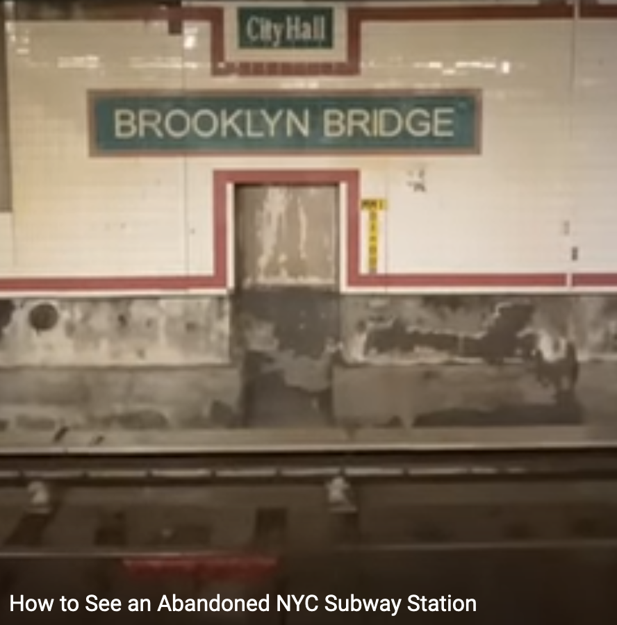
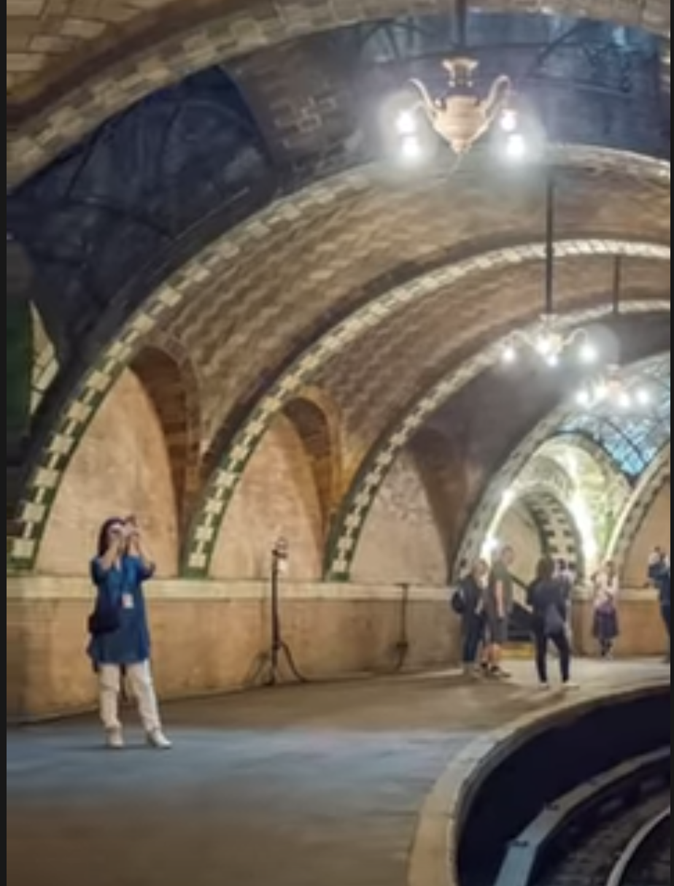
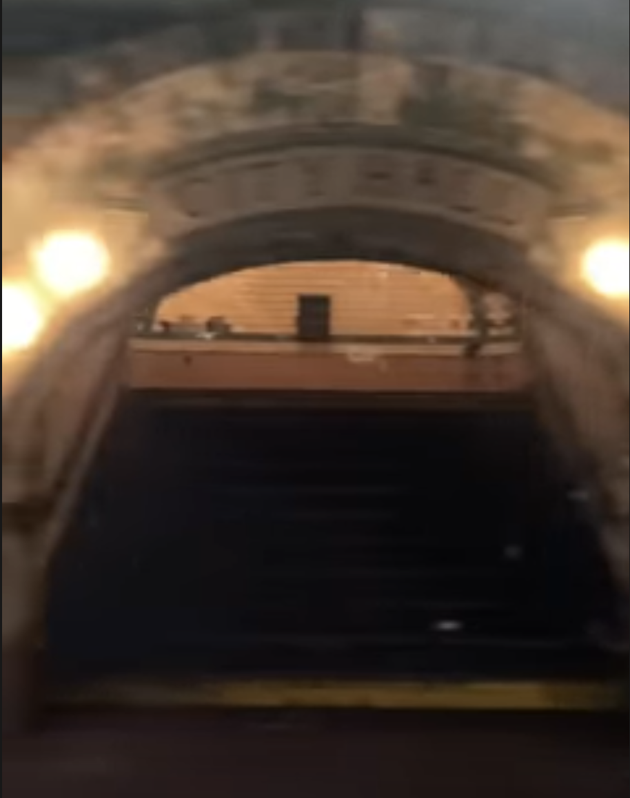

# How to See an Abandoned NYC Subway Station 
_For a 60 second youtube video about it, look here -> [Inquires](https://www.youtube.com/shorts/Tq2TlEwQkxM?feature=share)_ 

### City Hall Brooklyn Bridge Station

So it's like this station that just had a really LOUD noisy screeching sound. So they didn't put anything there. One dude wanted it to be a restaurant. But it was blocked by some other people. But it's actually a really nice place, and you can still see it by train!

### City Hall Station Drawing 

And it looks a lot like an art gallery or museum!

### Another Picture

Amirite? Meh?

### Go there by train

And like you can go there today! You just take the 6 train past the last stop. It circles back around and you can see it yourself! Click this link for google maps directions: . And please watch the youtube video where an ACTUAL New Yorker explains how to get there. 

 - For more history about the station, check [Wikipedia](https://en.wikipedia.org/wiki/City_Hall_station_(IRT_Lexington_Avenue_Line)
 - For google maps directions, try using this location pin on [Google Maps](https://g.page/city-hall-park?share)

